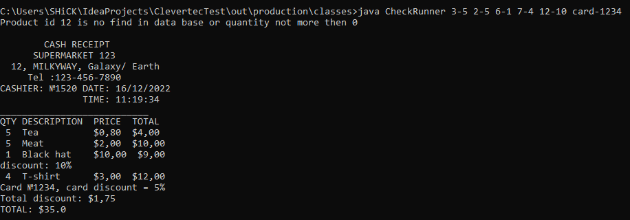

# CheckRunner
Консольное приложение, реализующее функционал формирования
чека в магазине.

### Используемые технологии
* Java 17
* gradle 7.5

### Запуск
* Установить java sdk и прописать переменные среды
* Скачать проект
* Открыть командную строку
* Перейти в директорию `ClevertecTest\out\production\classes`
* Ввести команду `java CheckRunner 3-5 2-5 6-1 7-4 12-10 card-1234`
* Результат выполнения

### Описание параметров запуска
Приложение запускается java CheckRunner <набор_параметров>, где набор
параметров в формате itemId-quantity (itemId - идентификатор товара, quantity -
его количество. Если нужно указать карту для скидки, укажите card-номерКарты.   

